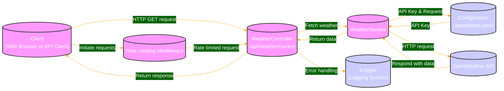

# Weather Data Retrieval System

The Weather Data Retrieval System provides real-time weather information based on geographic coordinates. It integrates with the OpenWeather API to fetch current weather conditions and offers a RESTful API endpoint for client applications.



## System Overview

This system is designed to access weather information via the OpenWeather API and expose this data through a RESTful interface implemented in an ASP.NET Core application. It handles incoming requests, communicates with external services, and provides data responses to clients.

## Getting Started

### Prerequisites

- .NET 8.0 SDK
- An IDE like Visual Studio or VS Code
- An API key from OpenWeatherMap

### Configuration

1. **API Key Setup**: Store your OpenWeather API key in your `appsettings.json` file under the `OpenWeatherSettings` section:

    ```json
    {
      "OpenWeatherSettings": {
        "ApiKey": "your_api_key_here",
        "BaseUrl": "https://api.openweathermap.org/data/2.5/"
      }
    }
    ```

2. **Running the Application**: Open your terminal or command prompt and navigate to the project directory. Run the following commands:

    ```bash
    dotnet restore
    dotnet build
    dotnet run
    ```

## System Architecture

- **Client**: Initiates requests via HTTP GET with latitude and longitude parameters.
- **WeatherController**: Manages incoming requests and responses. It interacts with the WeatherService to fetch data.
- **WeatherService**: Handles communication with the OpenWeather API, parsing and returning data.
- **OpenWeather API**: External API providing weather data.
- **Logging**: Utilizes `ILogger` for logging across the application.
- **Rate Limiting Middleware**: Limits request rates to prevent abuse and ensure service availability.

## Data Flow

1. **Client Request**: The client sends a request to the WeatherController.
2. **Controller to Service**: The controller passes the request to the WeatherService.
3. **Service to API**: The WeatherService requests data from OpenWeather API.
4. **Data Parsing and Response**: The service parses the API response and returns it to the controller, which then sends it back to the client.
5. **Error Handling**: Errors are logged, and appropriate error messages are returned to the client.

## Error Handling and Logging

- Errors from network issues or data processing are caught and logged.
- The WeatherController handles exceptions from the WeatherService.
- Detailed error information is provided to clients appropriately.

## Scalability and Performance

- The system is stateless, allowing it to scale horizontally as needed.
- Rate limiting protects against excessive requests.
- Future enhancements could include response caching to reduce dependency on external API calls.

## Security Considerations

- The OpenWeather API key is securely stored in the `appsettings.json` file and accessed via configuration management tools provided by ASP.NET Core.

## Conclusion

This documentation provides a comprehensive overview of the Weather Data Retrieval System designed for efficient, reliable, and scalable access to weather data. The system is built with robust practices to ensure security, performance, and maintainability.
