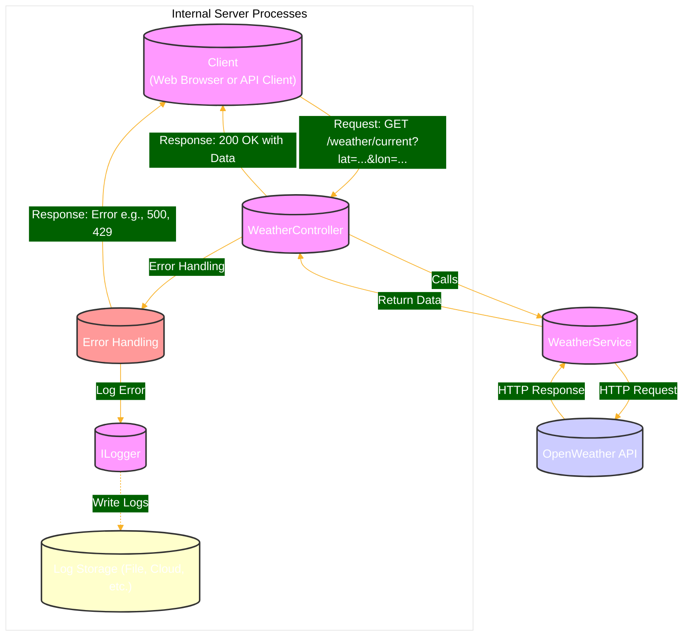

# Weather Data Retrieval System




## Overview

The Weather Data Retrieval System provides real-time weather information based on geographical coordinates. It is designed to integrate seamlessly with the OpenWeather API to fetch current weather conditions and expose this information through a RESTful API endpoint.


## System Components

- **WeatherController**: Serves as the entry point for client requests, managing HTTP GET requests that include latitude and longitude parameters.
- **WeatherService**: Handles communication with the OpenWeather API, processes the responses, and returns formatted weather data.
- **OpenWeather API**: External API providing detailed weather data.
- **Logging**: Utilizes `ILogger` for logging operations, aiding in debugging and operational monitoring.
- **Rate Limiting Middleware**: Protects the API from overuse by limiting the number of requests that a client can make within a specified time frame.

## Architecture

This system follows a client-server model with integration of an external API:

- **Client**: Any web browser or API client that sends requests to the system.
- **Server**: Hosts the WeatherController and WeatherService, processing incoming requests and fetching data from the OpenWeather API.
- **External API**: The OpenWeather API that provides the actual weather data based on coordinates.

## Data Flow

1. **Client Request**: Initiates with an HTTP GET request specifying latitude and longitude.
2. **WeatherController**: Receives the request and forwards it to the WeatherService.
3. **WeatherService**: Contacts the OpenWeather API, retrieves the weather data, and processes it.
4. **Response**: Sends the processed data back to the WeatherController, which returns it to the client.
5. **Error Handling**: Captures and logs errors at various stages, returning appropriate responses to the client.

## Error Handling and Logging

Errors are managed through comprehensive logging and specific error-handling mechanisms:

- Network issues or data processing errors within the WeatherService are caught and handled.
- Errors in the WeatherController are logged and managed, ensuring that the client receives a clear error response.

## Scalability and Performance

- **Statelessness**: The server's stateless nature allows it to handle multiple requests independently.
- **Rate Limiting**: Prevents server overload by limiting the number of requests a single client can make.
- **Caching Strategy**: (Future implementation) Could involve caching weather data responses to reduce API calls.

## Security Features

- **API Key Management**: Secure storage and management of API keys to prevent unauthorized access.
- **Rate Limiting**: Provides a basic layer of security against denial-of-service attacks.

## Getting Started

To set up and run the project locally:

```bash
git git@github.com:echenim/WeatherServiceAPIs.git
cd WeatherServiceAPIs
# Follow specific setup instructions for dependencies, environment variables, etc.
dotnet run
```